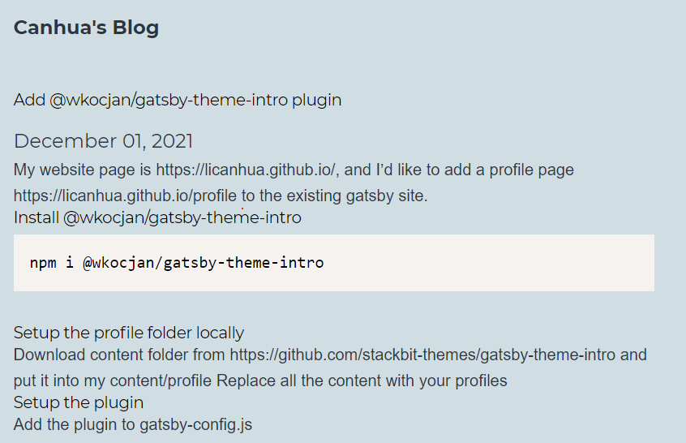

My main site is create gatsby-starter-blog. After I mixed it with @wkocjan/gatsby-theme-intro, the main site layout is changed because TailwindCSS override the default styles.

Finally you will see things like this



## Issue of @wkocjan/gatsby-theme-intro plugins
1. If you are not using TailwindCSS, don't try @wkocjan/gatsby-theme-intro. Otherwise you have to spend too much time to fix it 
2. contact form is not able to be disabled if you doesn't make code change. 
3. [shadowing](https://www.gatsbyjs.com/docs/how-to/plugins-and-themes/shadowing/) doesn't work well for component.

## How I resolved the issue
1. I created a new GitHub Pages [/profile](https://github.com/licanhua/profile) which is in another github repo.
2. It's able to shadow @wkocjan\gatsby-theme-intro\templates\index.js, then use your own component
You can get the new code [here](https://github.com/licanhua/profile/tree/main/src/%40wkocjan/gatsby-theme-intro/templates)

- Original code:
```
import CustomFonts from "../components/custom-fonts/custom-fonts"
import Footer from "../components/footer/footer"
import Header from "../components/header/header"
import MainContent from "../components/main-content/main-content"
import SEO from "../components/seo/seo"
import Sidebar from "../components/sidebar/sidebar"
import StructuredData from "../components/structured-data/structured-data"
import "../styles/style.css"
```

- Modified code:
```
import CustomFonts from "@wkocjan/gatsby-theme-intro/src/components/custom-fonts/custom-fonts"
import Footer from "@wkocjan/gatsby-theme-intro/src/components/footer/footer"
import Header from "../components/header/header"
import MainContent from "../components/main-content/main-content"
import SEO from "@wkocjan/gatsby-theme-intro/src/components/seo/seo"
import Sidebar from "@wkocjan/gatsby-theme-intro/src/components/sidebar/sidebar"
import StructuredData from "@wkocjan/gatsby-theme-intro/src/components/structured-data/structured-data"
import "@wkocjan/gatsby-theme-intro/src/styles/style.css"
import Nav from "../../../components/nav"
```

