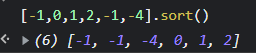

---
title: JavaScript misunderstood 
date: "2021-12-12T09:49:00.000Z"
description: "JavaScript doesn't work as expect"
tags: ["JavaScript", "Data Structures"]

---

# array.sort()
calling sort() by itself simply sorts the array in lexicographical (aka alphabetical) order

