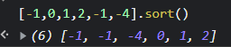

# array.sort()
calling sort() by itself simply sorts the array in lexicographical (aka alphabetical) order



# reduce
For `reduce(function(previousValue, currentValue)...`, most of time, previousValue and currentValue are the same type. Actually previousValue can be list, object which is different from currentValue too. 

```js
// map + filter
  entries() {
    return this.hashMap.keys.reduce((acc, key) => {
      if(key !== undefined) {
        acc.push(key.content);
      }
      return acc
    }, []);
  }

// Grouping objects by a property
let people = [
  { name: 'Alice', age: 21 },
  { name: 'Max', age: 20 },
  { name: 'Jane', age: 20 }
];

function groupBy(objectArray, property) {
  return objectArray.reduce(function (acc, obj) {
    let key = obj[property]
    if (!acc[key]) {
      acc[key] = []
    }
    acc[key].push(obj)
    return acc
  }, {})
}
```