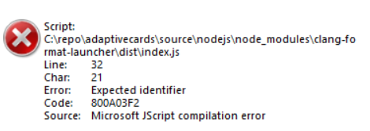

Do you believe ` #!/usr/bin/env node` will impact the npm shortcut on Windows? 
Yes, it did.

I created npmjs [clang-format-launcher](https://github.com/licanhua/clang-format-launcher) package, and I expect to run it with `npx clang-format-launcher` or `clang-format-launcher`, then I run into
.

The error message:
```
Error: Expected identifier
code: 800A03F2
Source: Microsoft JScript compilation error
```

If I run with `node node_modules\clang-format-launcher\dist\index.js`, then everything looks good.

I spent half an hour to investigate it, finally I found that the clang-format-launcher.bat is not emitted correct.

It's
```
"%~dp0\node_modules\clang-format-launcher\dist\index.js"   %*
```

but it should be
```
@IF EXIST "%~dp0\node.exe" (
  "%~dp0\node.exe"  "%~dp0\node_modules\clang-format-launcher\dist\index.js" %*
) ELSE (
  node  "%~dp0\node_modules\clang-format-launcher\dist\index.js" %*
)
```

After I revisit the document 
[package bin](https://docs.npmjs.com/cli/v6/configuring-npm/package-json#bin), 

> Please make sure that your file(s) referenced in bin starts with #!/usr/bin/env node, otherwise the scripts are started without the node executable!
