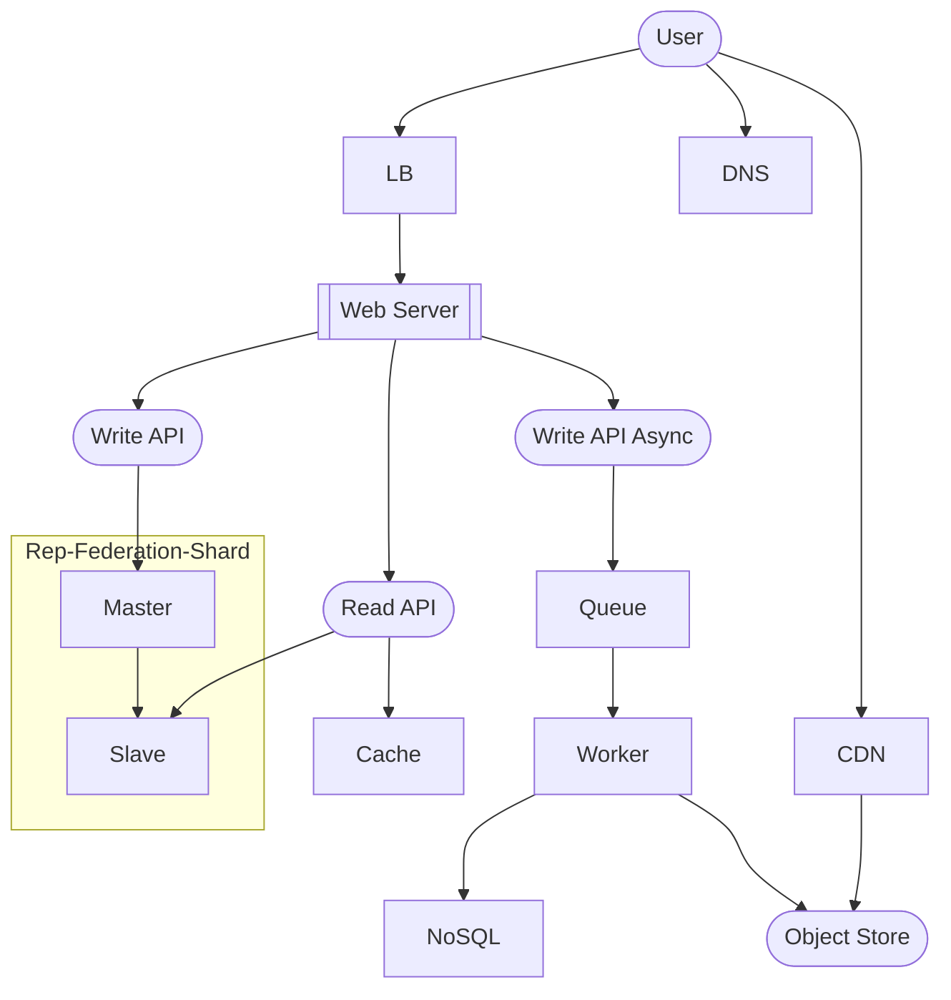

## Requirement
1. Post, Delete, Search, Image&Video, Comment, Like
2. CAP (Strong, Weak, or complete consistency, High Availability 99.999
3. Latency 95% returns 2 seconds
4. Read heavy, Write Heavy, and Read/Write ratio
4. Scalability, Security, Monitor, Log, Failover

## Estimation
Storage, request/second

## High Level Design

## Component Design
### DB Schema
### API

## Bottlenecks
1. Load Balance, Data Sharding, In Memory DB
2. Scale: Vertical/Horizatal, Cache(Application, DB Caching, In Memory), LB, DB rep, DB partition, Map-Reduce
